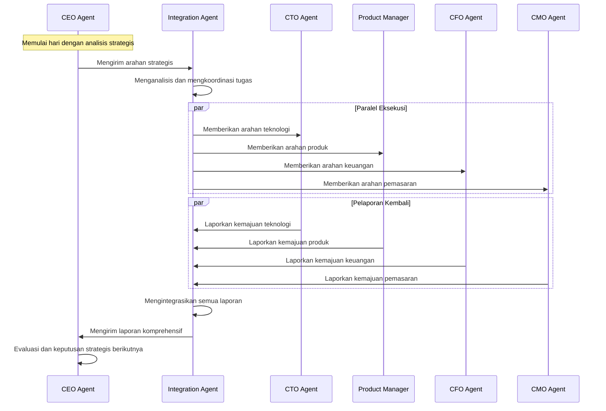
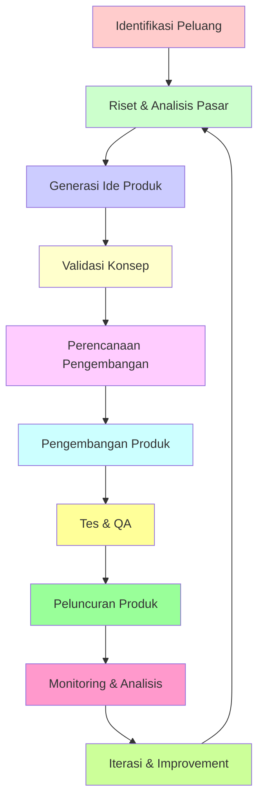
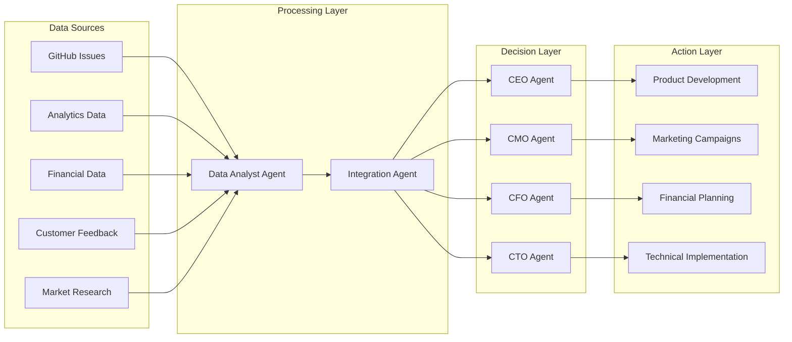
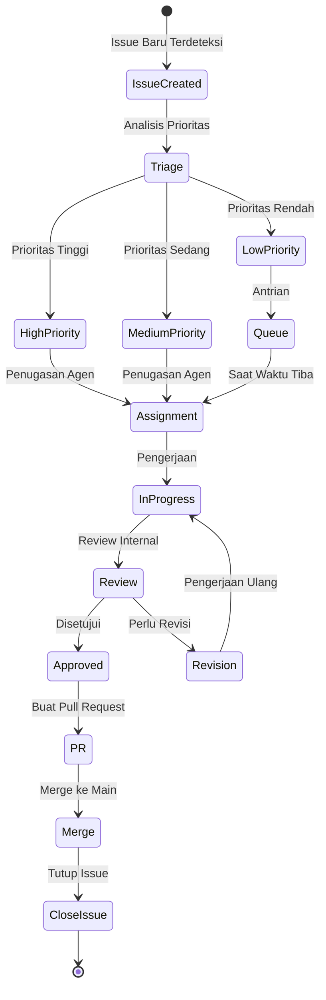

# Diagram Arsitektur Workflow Startup AI

## Hierarki Agen

```mermaid
graph TD
    CEO[CEO Agent<br/>Strategis & Leadership] --> Integration[Integration Agent<br/>Koordinasi & Integrasi]
    Integration --> CTO[CTO Agent<br/>Teknologi & Infrastruktur]
    Integration --> CMO[CMO Agent<br/>Pemasaran & Branding]
    Integration --> CFO[CFO Agent<br/>Keuangan & Investasi]
    Integration --> COO[COO Agent<br/>Operasional & Efisiensi]
    Integration --> PM[Product Manager Agent<br/>Pengembangan Produk]
    Integration --> RD[R&D Agent<br/>Inovasi & Riset]
    Integration --> CS[Customer Success Agent<br/>Layanan Pelanggan]
    Integration --> DA[Data Analyst Agent<br/>Analisis Data & Insight]
    Integration --> SEC[Security Officer Agent<br/>Keamanan Sistem]
    Integration --> HR[HR Agent<br/>Manajemen Talenta]
    Integration --> LEGAL[Legal & Compliance Agent<br/>Kepatuhan Regulasi]
    
    style CEO fill:#ff9999,stroke:#333,stroke-width:2px
    style Integration fill:#99ccff,stroke:#333,stroke-width:2px
    style CTO fill:#99ff99,stroke:#333,stroke-width:1px
    style CMO fill:#ffcc99,stroke:#333,stroke-width:1px
    style CFO fill:#cc99ff,stroke:#333,stroke-width:1px
    style COO fill:#ffff99,stroke:#333,stroke-width:1px
    style PM fill:#ff99cc,stroke:#333,stroke-width:1px
    style RD fill:#99ffcc,stroke:#333,stroke-width:1px
    style CS fill:#ccff99,stroke:#333,stroke-width:1px
    style DA fill:#ffccff,stroke:#333,stroke-width:1px
    style SEC fill:#ff9999,stroke:#333,stroke-width:1px
    style HR fill:#ccffff,stroke:#333,stroke-width:1px
    style LEGAL fill:#ccccff,stroke:#333,stroke-width:1px
```



## Alur Kerja Harian

```mermaid
gantt
    title Jadwal Eksekusi Agen Harian (UTC)
    dateFormat HH:mm
    axisFormat %H:%M
    
    section Leadership
    CEO Agent       :08:00, 30min
    Integration     :08:30, 30min
    
    section Core Operations
    CTO Agent       :09:00, 30min
    Product Manager :09:30, 30min
    CFO Agent       :10:00, 30min
    COO Agent       :10:30, 30min
    CMO Agent       :11:00, 30min
    
    section Support Operations
    R&D Agent       :14:00, 30min
    Data Analyst    :14:30, 30min
    Security Officer:15:00, 30min
    Customer Success:15:30, 30min
    HR Agent        :16:00, 30min
    Legal & Compliance:16:30, 30min
```



## Alur Komunikasi Antar Agen



## Siklus Pengembangan Produk



## Mekanisme Integrasi Data



## Alur Penanganan Issue



## Arsitektur Keamanan

```mermaid
graph TB
    subgraph "Security Layer"
        A[Security Officer Agent]
        B[Legal & Compliance Agent]
    end
    
    subgraph "Access Control"
        C[Role-Based Permissions]
        D[Secret Management]
        E[Audit Logging]
    end
    
    subgraph "Monitoring"
        F[Security Scanning]
        G[Compliance Checks]
        H[Incident Response]
    end
    
    subgraph "Agents"
        I[CEO Agent]
        J[CTO Agent]
        K[Other Agents]
    end
    
    A --> C
    A --> D
    A --> E
    B --> G
    A --> F
    B --> H
    
    C --> I
    C --> J
    C --> K
    D --> I
    D --> J
    D --> K